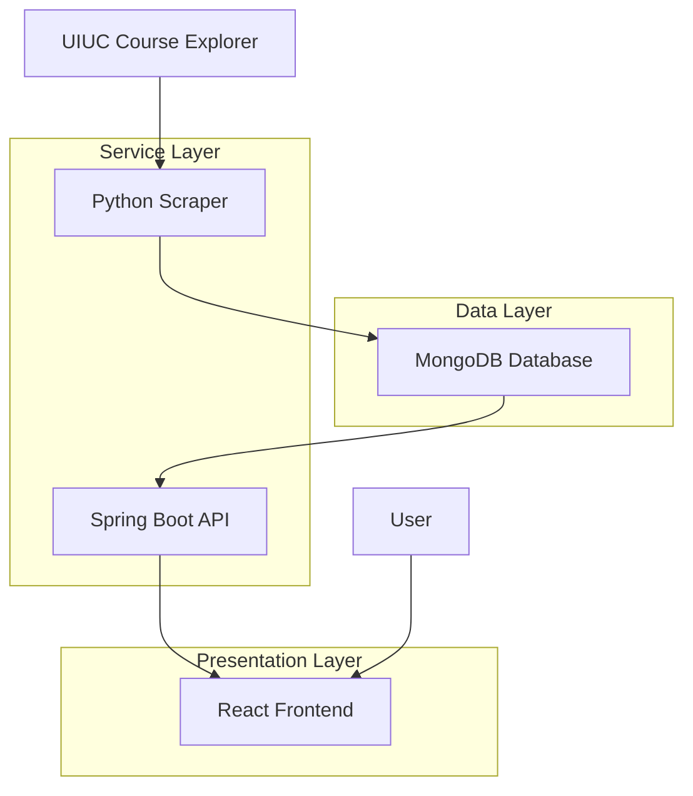

# Design Document

## Overview

The UIUC Study Space Finder is a full-stack web application that helps students locate available study spaces by scraping course schedules, processing room availability data, and presenting it through an interactive campus map. The system follows a modular architecture with clear separation of concerns with clear separation between data collection, API services, and user interface components.

## Architecture

### High-Level System Architecture



### Component Architecture

The system consists of four main components:

1. **Data Scraper Service** (Python): Automated data collection from Course Explorer
2. **Database Layer** (MongoDB): Persistent storage for room and schedule data
3. **API Service** (Spring Boot): RESTful backend providing room availability endpoints
4. **Web Frontend** (React): Interactive user interface with campus map

## Components and Interfaces

### 1. Python Scraper Service

**Purpose**: Automated collection and processing of course schedule data

**Key Components**:
- `CourseExplorerScraper`: Web scraping logic using BeautifulSoup
- `RoomNormalizer`: Standardizes room format to {building, room} structure
- `DatabaseClient`: MongoDB connection and data insertion
- `ScheduleProcessor`: Converts raw schedule data to availability windows

**Interfaces**:
- Input: UIUC Course Explorer HTML pages
- Output: Normalized room availability data to MongoDB

**Key Methods**:
```python
class CourseExplorerScraper:
    def scrape_department_courses(department_code: str) -> List[CourseData]
    def extract_meeting_info(course_html: str) -> List[MeetingTime]
    
class RoomNormalizer:
    def normalize_room_format(raw_room: str) -> RoomIdentifier
    def parse_building_room(room_string: str) -> Tuple[str, str]
    
class DatabaseClient:
    def insert_room_availability(room_data: List[RoomAvailability]) -> bool
    def update_last_scrape_timestamp() -> bool
```

### 2. MongoDB Database Schema

**Collections**:

**rooms**:
```json
{
  "_id": ObjectId,
  "building": "DCL",
  "room": "1320",
  "building_full_name": "Digital Computer Laboratory",
  "capacity": 50,
  "last_updated": ISODate,
  "availability": {
    "monday": [
      {"start_time": "08:00", "end_time": "09:30", "status": "occupied", "course": "CS 225"},
      {"start_time": "09:30", "end_time": "11:00", "status": "available"},
      {"start_time": "11:00", "end_time": "12:30", "status": "occupied", "course": "CS 374"}
    ],
    "tuesday": [...],
    // ... other days
  }
}
```

**buildings**:
```json
{
  "_id": ObjectId,
  "code": "DCL",
  "full_name": "Digital Computer Laboratory",
  "coordinates": {"lat": 40.1138, "lng": -88.2249},
  "total_rooms": 25,
  "available_rooms_count": 12,
  "last_updated": ISODate
}
```

**scrape_metadata**:
```json
{
  "_id": ObjectId,
  "last_scrape_time": ISODate,
  "departments_scraped": ["CS", "MATH", "PHYS"],
  "total_courses_processed": 1250,
  "errors": [],
  "status": "completed"
}
```

### 3. Spring Boot API Service

**Purpose**: RESTful backend providing room availability data

**Key Components**:
- `RoomController`: REST endpoints for room queries
- `BuildingController`: Campus building information endpoints
- `RoomService`: Business logic for availability calculations
- `DatabaseService`: MongoDB data access layer
- `AvailabilityCalculator`: Real-time availability computation

**REST Endpoints**:

```java
@RestController
@RequestMapping("/api/v1")
public class RoomController {
    
    @GetMapping("/buildings")
    public ResponseEntity<List<BuildingInfo>> getAllBuildings()
    
    @GetMapping("/buildings/{buildingCode}/rooms")
    public ResponseEntity<List<RoomAvailability>> getBuildingRooms(
        @PathVariable String buildingCode,
        @RequestParam(required = false) String day,
        @RequestParam(required = false) String time
    )
    
    @GetMapping("/rooms/{buildingCode}/{roomNumber}/schedule")
    public ResponseEntity<RoomSchedule> getRoomSchedule(
        @PathVariable String buildingCode,
        @PathVariable String roomNumber,
        @RequestParam(required = false) String date
    )
    
    @GetMapping("/availability/current")
    public ResponseEntity<List<AvailableRoom>> getCurrentlyAvailableRooms()
}
```

**Service Layer**:
```java
@Service
public class RoomService {
    public List<RoomAvailability> calculateCurrentAvailability(String buildingCode)
    public RoomSchedule generateDailySchedule(String building, String room, LocalDate date)
    public boolean isRoomAvailable(String building, String room, LocalDateTime time)
    public Duration getNextAvailabilityWindow(String building, String room)
}
```

### 4. React Frontend

**Purpose**: Interactive user interface with campus map and room information

**Key Components**:

**Pages**:
- `HomePage`: Landing page with campus map
- `BuildingDetailPage`: Room listings for selected building
- `RoomSchedulePage`: Detailed schedule view for specific room

**Components**:
- `CampusMap`: Interactive map with building markers
- `BuildingMarker`: Clickable building indicators with availability status
- `RoomList`: Available rooms display with time information
- `ScheduleGrid`: Visual time-block schedule display
- `AvailabilityIndicator`: Real-time availability status

**State Management**:
```javascript
// Redux store structure
{
  buildings: {
    list: [...],
    selected: null,
    loading: false
  },
  rooms: {
    currentBuilding: [...],
    selectedRoom: null,
    schedule: null
  },
  ui: {
    mapCenter: {lat, lng},
    currentTime: Date,
    selectedDay: 'monday'
  }
}
```

**Key React Components**:
```jsx
// CampusMap component
const CampusMap = () => {
  const [buildings, setBuildings] = useState([]);
  const [selectedBuilding, setSelectedBuilding] = useState(null);
  
  const handleBuildingClick = (building) => {
    fetchBuildingRooms(building.code);
    setSelectedBuilding(building);
  };
  
  return (
    <MapContainer>
      {buildings.map(building => (
        <BuildingMarker 
          key={building.code}
          building={building}
          onClick={handleBuildingClick}
          availabilityStatus={building.available_rooms_count > 0}
        />
      ))}
    </MapContainer>
  );
};

// RoomList component
const RoomList = ({ buildingCode }) => {
  const [rooms, setRooms] = useState([]);
  const currentTime = new Date();
  
  useEffect(() => {
    fetchRoomAvailability(buildingCode, currentTime);
  }, [buildingCode]);
  
  return (
    <div className="room-list">
      {rooms.map(room => (
        <RoomCard 
          key={`${room.building}-${room.room}`}
          room={room}
          currentAvailability={calculateCurrentStatus(room, currentTime)}
          nextAvailable={getNextAvailableTime(room, currentTime)}
        />
      ))}
    </div>
  );
};
```

## Data Models

### Core Data Models

**RoomIdentifier**:
```java
public class RoomIdentifier {
    private String building;
    private String room;
    private String fullBuildingName;
}
```

**TimeSlot**:
```java
public class TimeSlot {
    private LocalTime startTime;
    private LocalTime endTime;
    private AvailabilityStatus status;
    private String courseInfo; // optional, for occupied slots
}
```

**RoomAvailability**:
```java
public class RoomAvailability {
    private RoomIdentifier roomId;
    private DayOfWeek day;
    private List<TimeSlot> timeSlots;
    private LocalDateTime lastUpdated;
}
```

**BuildingInfo**:
```java
public class BuildingInfo {
    private String code;
    private String fullName;
    private Coordinates location;
    private int totalRooms;
    private int availableRoomsCount;
    private LocalDateTime lastUpdated;
}
```

### Data Flow Models

**Scraper Data Pipeline**:
1. Raw HTML → CourseData objects
2. CourseData → MeetingTime objects  
3. MeetingTime → RoomAvailability objects
4. RoomAvailability → MongoDB documents

**API Data Pipeline**:
1. HTTP Request → Controller
2. Controller → Service layer
3. Service → MongoDB query
4. MongoDB result → DTO transformation
5. DTO → JSON response

## Error Handling

### Scraper Error Handling

**Network Errors**:
- Retry mechanism with exponential backoff
- Fallback to cached data if scraping fails
- Error logging with detailed context

**Data Parsing Errors**:
- Skip malformed course entries
- Log parsing failures for manual review
- Continue processing remaining data

**Database Errors**:
- Transaction rollback for failed batch inserts
- Retry mechanism for connection issues
- Graceful degradation with error notifications

### API Error Handling

**Standard HTTP Error Responses**:
```java
@ExceptionHandler(RoomNotFoundException.class)
public ResponseEntity<ErrorResponse> handleRoomNotFound(RoomNotFoundException ex) {
    return ResponseEntity.status(404)
        .body(new ErrorResponse("ROOM_NOT_FOUND", ex.getMessage()));
}

@ExceptionHandler(DatabaseConnectionException.class)
public ResponseEntity<ErrorResponse> handleDatabaseError(DatabaseConnectionException ex) {
    return ResponseEntity.status(503)
        .body(new ErrorResponse("SERVICE_UNAVAILABLE", "Database temporarily unavailable"));
}
```

**Error Response Format**:
```json
{
  "error": {
    "code": "ROOM_NOT_FOUND",
    "message": "Room DCL-1320 not found",
    "timestamp": "2024-01-15T10:30:00Z",
    "path": "/api/v1/rooms/DCL/1320/schedule"
  }
}
```

### Frontend Error Handling

**Network Error Handling**:
- Loading states during API calls
- Retry buttons for failed requests
- Offline mode with cached data
- User-friendly error messages

**Data Validation**:
- Input validation for building/room codes
- Date range validation for schedule queries
- Graceful handling of empty results

## Testing Strategy

### Unit Testing

**Python Scraper Tests**:
- Mock HTTP responses for Course Explorer
- Test room normalization logic
- Validate database insertion methods
- Test error handling scenarios

**Spring Boot API Tests**:
- Controller endpoint testing with MockMvc
- Service layer unit tests with mocked dependencies
- Repository integration tests with embedded MongoDB
- Custom validation logic testing

**React Frontend Tests**:
- Component rendering tests with React Testing Library
- User interaction testing (map clicks, room selection)
- API integration tests with mocked endpoints
- Responsive design testing across screen sizes

### Integration Testing

**End-to-End Data Flow**:
- Scraper → Database → API → Frontend integration
- Real Course Explorer data processing
- Cross-component communication testing

**API Integration Tests**:
- Full request/response cycle testing
- Database state verification
- Error propagation testing

### Performance Testing

**Load Testing**:
- API endpoint performance under concurrent requests
- Database query optimization validation
- Frontend rendering performance with large datasets

**Scalability Testing**:
- Memory usage during large scraping operations
- Database performance with growing data sets
- Frontend responsiveness with many building markers

### Automated Testing Pipeline

**Continuous Integration**:
- Unit tests run on every commit
- Integration tests on pull requests
- Performance regression testing
- Code coverage reporting

**Test Data Management**:
- Seed data for consistent testing
- Test database isolation
- Mock data generation for edge cases

## Security Considerations

**Data Scraping Ethics**:
- Respectful scraping with appropriate delays
- User-Agent identification
- Compliance with robots.txt

**API Security**:
- Rate limiting on endpoints
- Input validation and sanitization
- CORS configuration for frontend access

**Data Privacy**:
- No personal information collection
- Public schedule data only
- Secure database connections

## Performance Optimization

**Database Optimization**:
- Indexes on building and room fields
- Compound indexes for time-based queries
- Data aggregation for building statistics

**API Optimization**:
- Response caching for frequently accessed data
- Pagination for large result sets
- Efficient MongoDB queries

**Frontend Optimization**:
- Lazy loading of building details
- Map marker clustering for performance
- Component memoization for re-renders